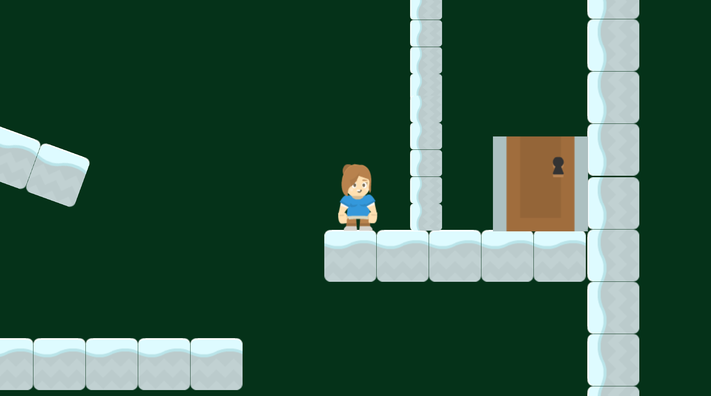
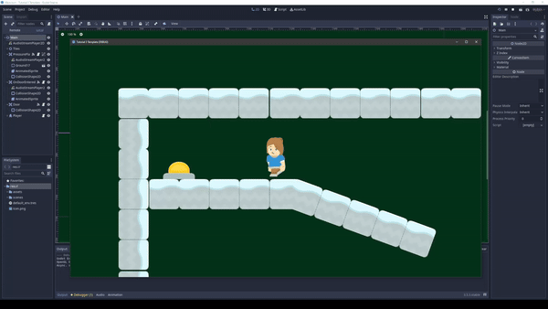
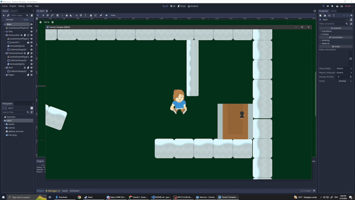
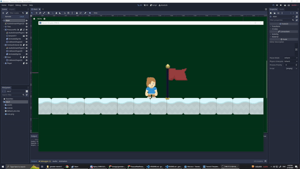

# Game Dev Tutorial 5

<p align='Center'>
    <a href="https://github.com/sponsors/alexandresanlim">
        
            <center>
                <h2>v3.5.3 LTS</h2>
            </center>  
    </a>
</p>

## 🎲 Latihan Mandiri - Membuat dan Menambah Variasi Aset 🎲

- ### Pressure Plate Into Object Removal & Accessible Area

    > Object interactivity complete each with its own sfx on player's interact
    
    Using on_body_entered, i can implement further it to play certain animations and moving the said platform so that the player gain access through the door.

    ```go
        // OnDoorEntered.gd

        extends Area2D

        func _on_OnDoorEntered_body_entered(body):
            if body.get_name() == "Player":
                $AnimatedSprite.play("opened")
                $AudioStreamPlayer2D.play()

        func _on_OnDoorEntered_body_exited(body):
            if body.get_name() == "Player":
                $AnimatedSprite.play("idle")
    ```
    ```go
        // PressurePlate.gd

        extends Area2D

        func _on_PressurePlate_body_entered(body : KinematicBody2D):
            if body.get_name() == "Player":
                $AnimatedSprite.play("pressed")
                $AudioStreamPlayer2D.play()
                $Ground17.move_local_x(-154)
    ```

    
    
    

- ### " New Background Music On Level 2 "

    > Just another chillax bgm on level 2
    
    Proceed through the door from level 1 to access.

    

##
## 🖮 Control & Keybinds 🖮

> As per usual, i decided to rebind the main control keys for our convenience.

- *W* = Jump, double tap it for double jump

- *A* = Move left

- *D* = Move right

- *A + S* = Slide left

- *D + S* = Slide right

- *E* = Dash to currently faced direction